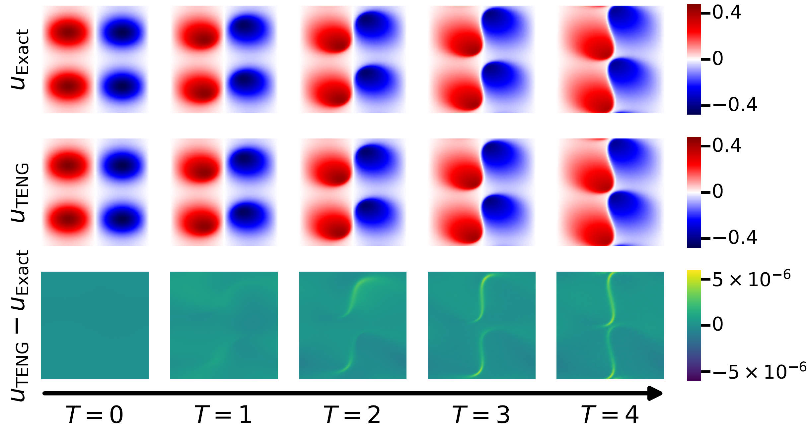

# TENG
Official Code for ICML paper TENG: Time-Evolving Natural Gradient for Solving PDEs with Deep Neural Net



```
@misc{chen2024teng,
      title={TENG: Time-Evolving Natural Gradient for Solving PDEs with Deep Neural Net}, 
      author={Zhuo Chen and Jacob McCarran and Esteban Vizcaino and Marin Soljačić and Di Luo},
      year={2024},
      eprint={2404.10771},
      archivePrefix={arXiv},
      primaryClass={cs.LG}
}
```
